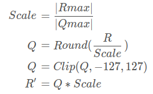

- `pictures`: 图片资源存放目录，用于存储项目相关的图像文件。
- `README.md`: 说明文档，当前你正在阅读的文件，包含了项目的概述和目录结构介绍。
- `src`: 源码目录，包含所有源代码和相关脚本。
  - `export-onnx`: 输出ONNX模型的脚本和配置文件，用于模型转换。
  - `ptq`: PTQ(Post-Training Quantization)量化目录，用于对预训练模型进行量化处理。
  - `qat`: QAT(Quantization-Aware Training)量化目录，用于在训练过程中集成量化意识。
  - `range`: 选择Range的方法目录，用于确定量化范围的策略和实现。
  - `static-quan`: 静态量化目录，包含静态量化方法的相关脚本和配置。

模型量化
流程:计算Scale=>量化=>截断=>反量化
-

Rmax 和 Rmin：目标数据类型的最小和最大整数值，例如8位无符号整数对应的范围是0至255。

Qmax 和 Qmin：原始浮点数模型中的最小和最大激活值。

Scale：缩放系数，用于将原始数据范围映射到目标数据范围。计算公式为 (Rmax - Rmin) / (Qmax - Qmin)。

Z：偏移量，用于确保经过缩放后的数据能够正确地分布在目标范围内。计算公式为 Qmax - Round(Rmax / Scale)。

Q：经过缩放和偏移后得到的整数激活值。计算公式为 Round((R / Scale) + Z)。

Clip(Q, -128, 127)：对结果进行截断操作，确保其落在指定的范围内。在这个例子中，范围是[-128, 127]。

R'：最终转换后的浮点数，计算公式为 (Q - Z) * Scale。

标准量化公式：
-

非对称量化：
-

对称量化：
-

对称量化 vs. 非对称量化
-

对称量化的优点：
没有偏移量，可以降低计算量
分布在正负半轴的权值数值均可被充分利用，具有更高的利用率；
对于深度学习模型，可以使用int8类型的乘法指令进行计算，加快运算速度；
能够有效的缓解权值分布在不同范围内的问题。

对称量化的缺点：
对于数据分布在0点附近的情况，量化的位数可能不够；
数据分布的范围过于分散，如果缺乏优秀的统计方法和规律，会导致量化效果不佳。

非对称量化的优点：
通过偏移量可以保证量化数据分布在非负数范围内，可以使得分辨率更高；
适合数据分布范围比较集中的情况。

非对称量化的缺点：
对于偏移量的计算需要额外的存储空间，增加了内存占用；
偏移量计算需要加减运算，会增加运算的复杂度；
对于深度学习模型，要使用int8类型的乘法指令进行计算，需要进行额外的偏置操作，增加了运算量。
